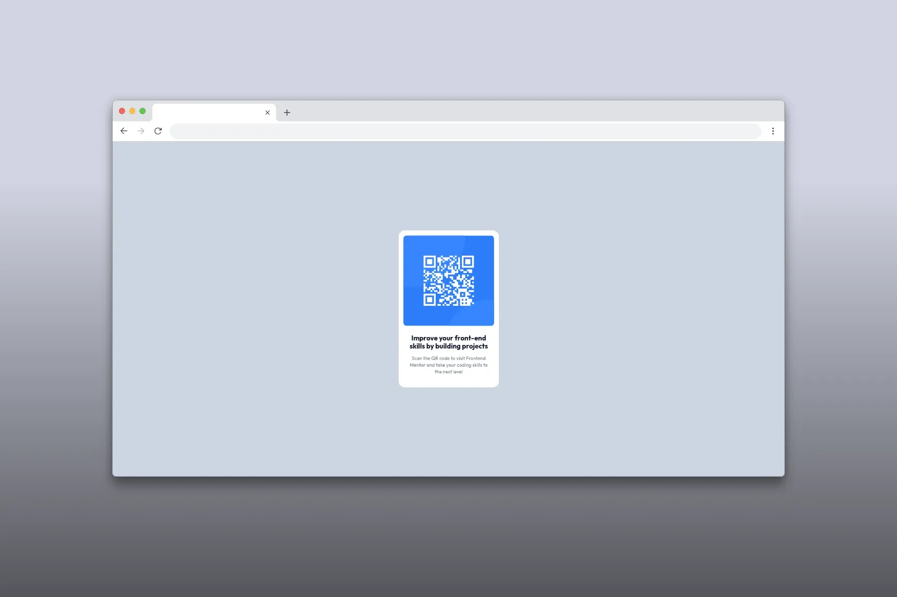
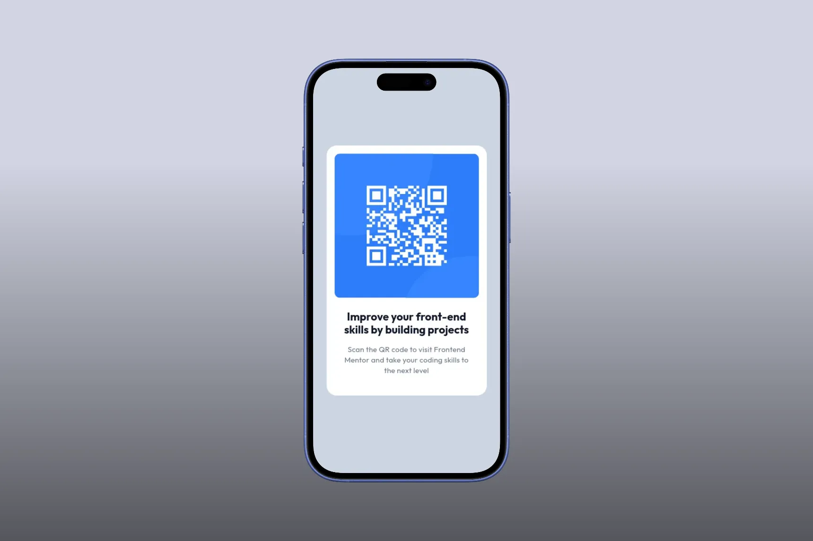

# Frontend Mentor - QR code component solution

This is a solution to the
[QR code component challenge on Frontend Mentor](https://frontendmentor.io/challenges/qr-code-component-iux_sIO_H).
Frontend Mentor challenges help you improve your coding skills by building
realistic projects.

## Table of contents

- [Overview](#overview)
  - [Screenshots](#screenshots)
  - [Links](#links)
- [My process](#my-process)
  - [Built with](#built-with)
  - [Useful resources](#useful-resources)
- [Author](#author)

## Overview

### Screenshots

### Links

- Solution URL: [Add solution URL here](https://your-solution-url.com)
- Live Site URL: [Add live site URL here](https://your-live-site-url.com)

## My process

### Built with

- Astro
- Tailwind CSS

### Useful resources

- [Squoosh](https://squoosh.app) - To optimize images
- [Fontsource](https://fontsource.org) - Fonts
- [Shots](https://shots.so) - Mockups

## Author

- Frontend Mentor - [@Sir-M4kU](https://www.frontendmentor.io/profile/Sir-M4kU)
